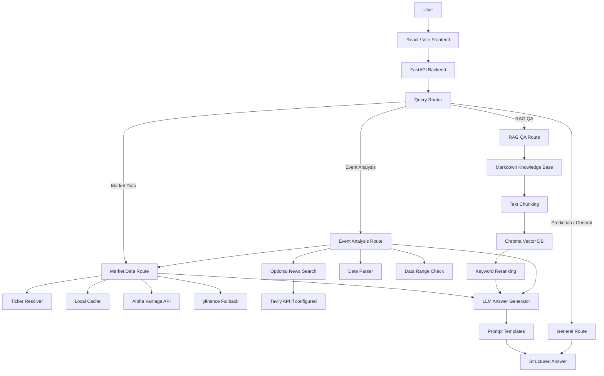

# Financial Asset QA System 金融资产问答系统

这是一个基于 **React 前端 + FastAPI 后端 + 金融行情 API + RAG 知识库 + LLM 结构化回答生成** 的金融资产问答系统。

项目目标不是做一个简单的 ChatGPT 套壳，而是实现一个能够根据问题类型自动选择工具的金融问答系统：

- 行情类问题：调用外部行情 API 获取真实价格数据
- 金融知识类问题：通过本地金融知识库和 Chroma 向量检索回答
- 事件分析类问题：结合历史行情、成交量、可选新闻搜索和 LLM 总结
- 财报知识类问题：基于财报知识库解释季度财报摘要核心指标
- 预测类问题：明确拒绝预测未来股价，不提供买卖建议

系统重点是：**数据驱动、结构清晰、可解释、减少 hallucination**。

---

## 1. 项目功能

### 1.1 资产行情问答

示例问题：

```text
BABA 最近 7 天涨跌情况如何？
AAPL 最近 7 天涨跌情况
腾讯股价多少？
谷歌近期表现如何？
特斯拉近期走势如何？
```

系统会自动：

1. 识别公司名称或股票代码
2. 调用行情数据源
3. 获取历史价格数据
4. 计算涨跌额和涨跌幅
5. 判断趋势：上涨 / 下跌 / 震荡
6. 返回结构化回答和数据来源

回答结构：

```text
【结论】
【客观数据】
【趋势分析】
【数据来源】
【风险提示】
```

---

### 1.2 事件分析

示例问题：

```text
阿里巴巴为何 5 月 6 日大涨？
苹果为何昨天大涨？
英伟达为何上周大涨？
特斯拉 4 月 30 日为什么跌了？
苹果为何 2020 年 3 月 1 日大跌？
```

系统会自动：

1. 识别 ticker
2. 解析日期，包括“昨天”“上周五”“2020 年 3 月 1 日”等
3. 查询事件日行情
4. 计算当日涨跌幅
5. 对比当日成交量和前 10 个交易日平均成交量
6. 可选调用新闻搜索模块
7. 使用 LLM 或模板生成结构化事件分析
8. 输出不确定性说明，避免编造因果关系

如果用户的问题假设不成立，例如：

```text
阿里巴巴为何 1 月 15 日大涨？
```

但数据显示当天只上涨 0.61%，系统会说明这是“小幅波动/震荡”，而不是顺着用户问题编造“大涨原因”。

---

### 1.3 金融知识 RAG 问答

示例问题：

```text
什么是市盈率？
收入和净利润的区别是什么？
现金流为什么重要？
资产负债表是什么？
季度财报摘要应该看哪些指标？
```

系统会先从本地金融知识库检索相关文档，再生成回答。

当前知识库：

```text
backend/docs/
├── pe_ratio.md
├── revenue_vs_net_income.md
├── cash_flow.md
├── balance_sheet.md
└── earnings_report_basics.md
```

RAG 流程：

1. 读取 Markdown 文档
2. 文档分块
3. 存入 Chroma 向量数据库
4. 向量检索相关 chunk
5. 关键词 rerank 优化中文金融概念检索
6. 使用 LLM 或模板生成带来源的结构化回答

---

### 1.4 财报摘要能力

系统支持财报摘要相关知识问答，例如：

```text
季度财报摘要应该看哪些指标？
EPS 是什么？
业绩指引为什么重要？
毛利率怎么看？
```

当前版本提供财报分析框架，包括：

- Revenue 营收
- Net Income 净利润
- EPS 每股收益
- Gross Margin 毛利率
- Operating Cash Flow 经营现金流
- Guidance 业绩指引

注意：当前系统不会编造某家公司真实最新季度财报。如果要查询公司真实财报，需要进一步接入 SEC EDGAR、公司 Investor Relations 页面或财报 API。

---

### 1.5 预测类问题处理

示例问题：

```text
帮我预测一下英伟达明天的股价
苹果未来会涨吗？
特斯拉下周目标价是多少？
```

系统会返回：

```text
【无法提供预测】
本系统不预测未来股价，也不提供买卖建议。
```

系统可以提供替代分析：

- 最近 7 天 / 30 天历史走势
- 已发生日期的事件分析
- 历史涨跌幅和成交量变化
- 金融指标解释

---

## 2. 系统架构图



---

## 3. 技术选型说明

### 3.1 为什么使用 FastAPI？

选择 FastAPI 的原因：

- Python 生态适合接入 yfinance、Alpha Vantage、ChromaDB 和 LLM SDK
- FastAPI 原生支持 Pydantic 数据校验
- API 结构清晰，适合快速构建 `/api/chat`、`/api/ingest` 等接口
- 自动生成 OpenAPI 文档，方便调试和扩展
- 性能和工程结构比简单 Flask demo 更适合展示后端设计能力

---

### 3.2 为什么使用 React + Vite？

选择 React + Vite 的原因：

- Vite 启动快，适合快速开发 demo
- React 适合构建聊天式交互界面
- 前后端分离，结构清楚
- 可以清晰展示 route badge、sources、market history table 等模块
- 比 Next.js 更轻量，减少部署和学习成本

---

### 3.3 为什么使用 ChromaDB？

选择 ChromaDB 的原因：

- 本地可运行，不依赖额外云服务
- 支持持久化存储，适合 demo 和离线知识库
- 与 Python RAG pipeline 集成简单
- 相比 FAISS，Chroma 自带 collection、metadata、document storage，更适合小型知识库 demo
- 方便展示 document chunk、source、distance 等检索信息

---

### 3.4 为什么使用 Alpha Vantage + yfinance？

选择 Alpha Vantage 的原因：

- 提供公开股票日线数据 API
- 数据结构清晰，便于计算 open/high/low/close/volume
- 适合构建市场数据 grounding

选择 yfinance 作为 fallback 的原因：

- 上手快
- 可作为 Alpha Vantage 限速时的备用数据源
- 能提升 demo 稳定性

系统还加入了 local cache，减少重复请求，保护 API quota。

---

### 3.5 为什么使用 rule-based Query Router？

当前版本使用 rule-based router，而不是一开始就使用复杂 Agent，原因是：

- 路由规则清晰，可解释
- 容易测试边界 case
- 避免 LLM router 自身出现不稳定分类
- 对 demo 来说足够覆盖核心问题类型

未来可以升级为 LLM-based router 或 LangGraph agent。

---

### 3.6 为什么使用模板 fallback + LLM optional？

金融问答对准确性要求高。系统不能在 LLM 不可用或数据不足时随便生成答案。

因此当前设计是：

- 有 `DEEPSEEK_API_KEY`：调用 DeepSeek LLM 基于真实数据和检索结果生成回答
- 没有 key 或调用失败：降级到 deterministic template fallback
- 不允许 LLM 自由编造价格、成交量、新闻、财报或政策

这样既满足 LLM 集成要求，也保证系统稳定可运行。

---

## 4. Prompt 设计思路

系统将 Prompt 独立放在：

```text
backend/app/prompts.py
```

包含三类 Prompt：

```text
MARKET_ANSWER_PROMPT
RAG_ANSWER_PROMPT
EVENT_ANALYSIS_PROMPT
```

---

### 4.1 Market Answer Prompt

用于行情问答。

核心约束：

- 所有价格、涨跌幅、成交量必须来自 `market_data`
- 不得凭记忆编造数字
- 不得预测未来价格
- 必须区分客观数据和趋势分析
- 不得将相关性描述为因果关系

输出结构：

```text
【结论】
【客观数据】
【趋势分析】
【数据来源】
【风险提示】
```

---

### 4.2 RAG Answer Prompt

用于金融知识问答。

核心约束：

- 回答必须以 `retrieved_docs` 为主要依据
- 如果需要补充通识知识，必须标注“补充说明，非知识库内容”
- 不得编造公式、监管规定或具体数据
- 如果知识库没有覆盖，必须说明“当前知识库暂未覆盖该主题”

输出结构：

```text
【核心定义】
【详细说明】
【常见误区】
【知识来源】
```

---

### 4.3 Event Analysis Prompt

用于事件分析。

核心约束：

- 价格和成交量必须来自真实 market data
- 如果涨跌幅绝对值小于 2%，必须先纠正用户“大涨/大跌”的前提
- 新闻摘要只能作为参考，不能把相关性说成确定因果
- 如果新闻搜索未配置，必须说明“当前未获取到可靠相关新闻”
- 不得捏造新闻、财报日期、政策或公司公告
- 不预测未来走势

输出结构：

```text
【事实核查】
【可能影响因素分析】
【不确定性说明】
【数据来源】
【风险提示】
```

---

## 5. LLM 集成模块

LLM 模块位于：

```text
backend/app/llm.py
```

当前使用 DeepSeek，兼容 OpenAI SDK 调用方式。

设计逻辑：

```text
有 DEEPSEEK_API_KEY
    → 调用 deepseek-chat
无 DEEPSEEK_API_KEY
    → 返回模板 fallback
LLM 调用失败
    → 返回模板 fallback
```

LLM 的角色不是直接回答问题，而是基于系统已经准备好的 grounded context 进行结构化总结。

LLM 输入包括：

- market_data
- retrieved_docs
- event_data
- news_summary

LLM 不允许：

- 编造行情数据
- 编造新闻
- 编造财报
- 编造政策
- 预测未来股价
- 将相关性描述为确定因果

---

## 6. 新闻搜索模块

新闻搜索模块位于：

```text
backend/app/news_search.py
```

当前支持 Tavily API。

逻辑：

```text
有 TAVILY_API_KEY
    → 调用 Tavily Search API 获取相关新闻摘要
无 TAVILY_API_KEY
    → 明确说明新闻搜索未配置
搜索失败
    → 返回友好提示，不暴露内部错误
```

事件分析中，新闻摘要只作为参考，不作为确定因果证据。

如果新闻搜索未配置，系统会明确说明：

```text
新闻搜索未配置，事件原因分析将仅基于量价数据。
```

---

## 7. 数据来源

### 7.1 行情数据

主要来源：

```text
Alpha Vantage TIME_SERIES_DAILY
```

备用来源：

```text
yfinance
```

本地 fallback：

```text
backend/cache/
```

### 7.2 RAG 数据

本地 Markdown 文档：

```text
backend/docs/
```

### 7.3 新闻数据

可选来源：

```text
Tavily Search API
```

如果没有配置 Tavily key，系统不会编造新闻。

---

## 8. 环境变量配置

在 `backend/` 下创建 `.env`：

```bash
cd backend
touch .env
```

内容：

```env
ALPHA_VANTAGE_API_KEY=your_alpha_vantage_api_key_here
DEEPSEEK_API_KEY=your_deepseek_api_key_here
TAVILY_API_KEY=your_tavily_api_key_here
```

注意：

真实 `.env` 不要提交到 GitHub。

GitHub 中只保留：

```text
backend/.env.example
```

`.env.example` 示例：

```env
ALPHA_VANTAGE_API_KEY=your_alpha_vantage_api_key_here
DEEPSEEK_API_KEY=your_deepseek_api_key_here
TAVILY_API_KEY=your_tavily_api_key_here
```

---

## 9. 本地运行方式

### 9.1 后端

```bash
cd backend
python3 -m venv .venv
source .venv/bin/activate
pip install -r requirements.txt
uvicorn app.main:app --reload --port 8000
```

测试：

```bash
curl http://localhost:8000/api/health
```

---

### 9.2 构建 RAG Index

```bash
curl -X POST http://localhost:8000/api/ingest
```

---

### 9.3 前端

另开一个 terminal：

```bash
cd frontend
npm install
npm run dev
```

打开：

```text
http://localhost:5173
```

---

## 10. API 说明

### Health Check

```text
GET /api/health
```

### Build RAG Index

```text
POST /api/ingest
```

### Chat

```text
POST /api/chat
```

请求：

```json
{
  "question": "BABA 最近 7 天涨跌情况如何？"
}
```

返回：

```json
{
  "route": "market_data",
  "answer": "...",
  "sources": ["Alpha Vantage TIME_SERIES_DAILY"],
  "data": {
    "detected_ticker": "BABA"
  }
}
```

---

## 11. Ticker Resolver

支持示例：

```text
阿里巴巴 → BABA
特斯拉 → TSLA
苹果 → AAPL
英伟达 → NVDA
微软 → MSFT
亚马逊 → AMZN
谷歌 → GOOGL
腾讯 → TCEHY
台积电 → TSM
京东 → JD
拼多多 → PDD
百度 → BIDU
比亚迪 → BYDDY
小米 → XIACF
```

如果无法识别，公司名不会被乱猜，系统会提示用户输入明确 ticker。

---

## 12. 日期解析和数据范围保护

支持：

```text
今天
昨天
上周
上周五
1 月 15 日
2026 年 1 月 15 日
2026-01-15
2026/01/15
```

系统会检查用户询问日期是否在可用行情数据范围内。

如果用户问：

```text
苹果为何 2020 年 3 月 1 日大跌？
```

但当前数据只覆盖近期，系统会拒绝误导性回答：

```text
系统无法查询该日期的行情数据，因此不会生成可能误导的结论。
```

这避免了把 2020 年问题错误映射到 2026 年数据。

---

## 13. 幻觉控制策略

系统采用多层 hallucination control：

1. 行情数据必须来自外部 API 或缓存
2. 金融知识必须基于 RAG 检索
3. LLM 只能基于提供的 context 总结
4. 日期超出范围时拒绝回答
5. 预测类问题直接拒绝
6. 原始 API 错误会被清洗，不暴露 API key
7. 事件分析不把相关性说成因果
8. 用户前提错误时，系统会用数据纠正前提

---

## 14. 已修复的重要 Bug

### 14.1 相对日期无法解析

已支持：

```text
昨天
上周
上周五
今天
```

---

### 14.2 年份被忽略

已修复：

```text
2020 年 3 月 1 日
```

不会再被当成当前年份。

---

### 14.3 腾讯无法识别

已添加：

```text
腾讯 → TCEHY
```

并补充多个常见中概股和 ADR。

---

### 14.4 Alpha Vantage API key 暴露

已修复：

- 原始 provider error 会被 sanitize
- 前端不会显示真实 API key
- `.env` 被 `.gitignore` 忽略
- README 只提供 `.env.example`

---

### 14.5 预测问题误触发行情 API

已修复：

```text
帮我预测一下英伟达明天的股价
```

现在会走 general route，并返回“不提供预测”。

---

## 15. 测试问题

### Market Data

```text
BABA 最近 7 天涨跌情况如何？
腾讯股价多少？
谷歌最近 30 天表现如何？
特斯拉近期走势如何？
```

### RAG

```text
什么是市盈率？
什么是现金流？
收入和净利润的区别是什么？
季度财报摘要应该看哪些指标？
```

### Event Analysis

```text
阿里巴巴为何 5 月 6 日大涨？
苹果为何昨天大涨？
英伟达为何上周大涨？
苹果为何 2020 年 3 月 1 日大跌？
```

### Prediction Refusal

```text
帮我预测一下英伟达明天的股价
```

---

## 16. 当前限制

1. 不预测未来股价
2. 不提供投资建议
3. 新闻搜索依赖 Tavily API key
4. Alpha Vantage 免费 API 有请求限制
5. 财报摘要目前主要提供分析框架，不抓取实时公司财报
6. RAG 知识库规模较小
7. 更复杂的多轮 Agent workflow 可继续扩展

---

## 17. 后续优化方向

1. 接入 SEC EDGAR 获取真实财报
2. 接入公司 Investor Relations 页面
3. 增加更多行情数据源 fallback
4. 增加股票走势图
5. 使用 LangGraph 做多工具 Agent
6. 增加单元测试
7. 增加 Docker Compose 一键启动
8. 增加更完善的 API rate limit cache
9. 扩充金融知识库
10. 增加部署配置

---

## 18. 提交前检查

后端：

```bash
cd backend
source .venv/bin/activate
python -m py_compile app/*.py
```

前端：

```bash
cd frontend
npm run build
```

Git 检查：

```bash
git status
```

确认不要提交：

```text
backend/.env
backend/.venv/
frontend/node_modules/
backend/cache/
backend/chroma_db/
```

---

## 19. 免责声明

本项目仅用于学习、技术展示和面试 demo。

本系统不构成：

- 投资建议
- 金融建议
- 交易建议
- 买卖推荐
- 未来价格预测

所有行情数据来自第三方数据源，例如 Alpha Vantage 和 yfinance。数据准确性、延迟和可用性取决于第三方服务。

用户在做任何金融决策前，应参考官方财报、交易所数据、公司公告、SEC 文件或专业金融数据源。