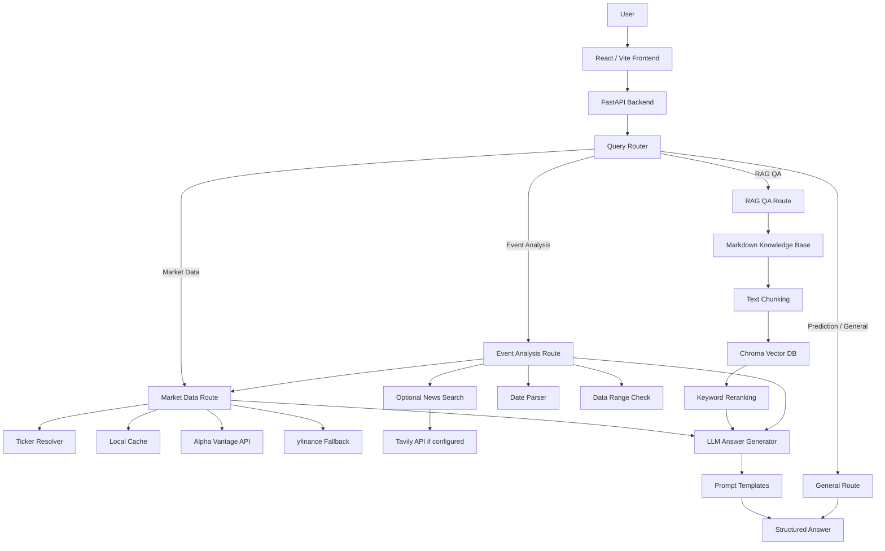

# Financial Asset Q&A System

A financial asset question-answering system built with a **React frontend, FastAPI backend, financial market APIs, a RAG knowledge base, and LLM-powered structured response generation**.

Rather than being a simple ChatGPT wrapper, the project automatically selects the appropriate tool based on the type of question:

- Market questions: retrieve real price data from external market APIs
- Financial knowledge questions: answer using a local financial knowledge base and Chroma vector search
- Event analysis questions: combine historical prices, trading volume, optional news search, and LLM summaries
- Earnings questions: explain the key metrics in quarterly earnings summaries using the earnings knowledge base
- Prediction questions: explicitly decline to predict future stock prices or provide trading advice

The system focuses on being **data-driven, well-structured, explainable, and resistant to hallucinations**.

---

## 1. Features

### 1.1 Market Data Q&A

Example questions:

```text
How has BABA performed over the last 7 days?
AAPL performance over the last 7 days
What is Tencent's stock price?
How has Google performed recently?
What is Tesla's recent trend?
```

The system automatically:

1. Identifies the company name or ticker symbol
2. Calls a market data source
3. Retrieves historical price data
4. Calculates the price and percentage changes
5. Classifies the trend as upward, downward, or sideways
6. Returns a structured answer with data sources

Response structure:

```text
[Conclusion]
[Objective Data]
[Trend Analysis]
[Data Sources]
[Risk Disclaimer]
```

---

### 1.2 Event Analysis

Example questions:

```text
Why did Alibaba surge on May 6?
Why did Apple rise sharply yesterday?
Why did NVIDIA surge last week?
Why did Tesla fall on April 30?
Why did Apple plunge on March 1, 2020?
```

The system automatically:

1. Identifies the ticker
2. Parses dates, including phrases such as "yesterday," "last Friday," and "March 1, 2020"
3. Retrieves market data for the event date
4. Calculates the daily percentage change
5. Compares that day's trading volume with the average volume over the previous 10 trading days
6. Optionally calls the news search module
7. Uses an LLM or template to generate a structured event analysis
8. Communicates uncertainty to avoid inventing causal explanations

If the premise of a question is incorrect—for example:

```text
Why did Alibaba surge on January 15?
```

but the data shows that the stock rose by only 0.61%, the system describes it as a minor move or sideways trading instead of fabricating a reason for a "surge."

---

### 1.3 Financial Knowledge Q&A with RAG

Example questions:

```text
What is the price-to-earnings ratio?
What is the difference between revenue and net income?
Why is cash flow important?
What is a balance sheet?
Which metrics should I review in a quarterly earnings summary?
```

The system retrieves relevant documents from the local financial knowledge base before generating an answer.

Current knowledge base:

```text
backend/docs/
├── pe_ratio.md
├── revenue_vs_net_income.md
├── cash_flow.md
├── balance_sheet.md
└── earnings_report_basics.md
```

RAG pipeline:

1. Read Markdown documents
2. Split documents into chunks
3. Store the chunks in a Chroma vector database
4. Retrieve relevant chunks with vector search
5. Apply keyword reranking to improve retrieval of Chinese financial concepts
6. Use an LLM or template to generate a structured answer with sources

---

### 1.4 Earnings Summary Support

The system supports knowledge questions about earnings summaries, such as:

```text
Which metrics should I review in a quarterly earnings summary?
What is EPS?
Why is guidance important?
How should I interpret gross margin?
```

The current version provides an earnings analysis framework that covers:

- Revenue
- Net income
- Earnings per share (EPS)
- Gross margin
- Operating cash flow
- Guidance

Note: the current system does not fabricate a company's actual latest quarterly results. Retrieving real company filings would require an additional integration with SEC EDGAR, company investor relations pages, or an earnings data API.

---

### 1.5 Handling Prediction Questions

Example questions:

```text
Predict NVIDIA's stock price tomorrow.
Will Apple go up in the future?
What is Tesla's target price next week?
```

The system responds with:

```text
[Prediction Unavailable]
This system does not predict future stock prices or provide trading advice.
```

It can offer alternative analysis, including:

- Historical performance over the last 7 or 30 days
- Event analysis for dates in the past
- Historical price and volume changes
- Explanations of financial metrics

---

## 2. System Architecture



---

## 3. Technology Choices

### 3.1 Why FastAPI?

FastAPI was selected because:

- Python's ecosystem works well with yfinance, Alpha Vantage, ChromaDB, and LLM SDKs
- FastAPI provides native Pydantic data validation
- Its clear API structure is well suited to endpoints such as `/api/chat` and `/api/ingest`
- It automatically generates OpenAPI documentation for easier debugging and extension
- Its performance and project structure are better suited to demonstrating backend engineering than a simple Flask demo

---

### 3.2 Why React and Vite?

React and Vite were selected because:

- Vite starts quickly and is well suited to rapid demo development
- React works well for chat-style interfaces
- The separated frontend and backend provide a clear project structure
- Components such as route badges, sources, and market history tables can be presented clearly
- The stack is lighter than Next.js, reducing deployment complexity and the learning curve

---

### 3.3 Why ChromaDB?

ChromaDB was selected because:

- It runs locally without requiring an additional cloud service
- It supports persistent storage for demos and offline knowledge bases
- It integrates easily with Python RAG pipelines
- Unlike FAISS, Chroma includes collections, metadata, and document storage, making it a good fit for a small knowledge-base demo
- It makes retrieval details such as document chunks, sources, and distances easy to inspect

---

### 3.4 Why Alpha Vantage and yfinance?

Alpha Vantage was selected because:

- It provides a public API for daily stock data
- Its clear data structure makes open, high, low, close, and volume calculations straightforward
- It provides grounding for market-data answers

yfinance is used as a fallback because:

- It is quick to set up
- It provides a backup when Alpha Vantage is rate-limited
- It improves demo reliability

The system also includes a local cache to reduce duplicate requests and conserve API quota.

---

### 3.5 Why a Rule-Based Query Router?

The current version uses a rule-based router instead of starting with a complex agent because:

- Routing rules are clear and explainable
- Edge cases are easy to test
- It avoids unstable classifications from an LLM router
- It covers the core question types required for the demo

The router can later be upgraded to an LLM-based router or a LangGraph agent.

---

### 3.6 Why an Optional LLM with a Template Fallback?

Financial Q&A requires a high degree of accuracy. The system must not generate arbitrary answers when the LLM is unavailable or the supporting data is insufficient.

The current design therefore works as follows:

- If `DEEPSEEK_API_KEY` is configured, DeepSeek generates an answer from real data and retrieval results
- If the key is missing or the request fails, the system falls back to deterministic templates
- The LLM is not allowed to invent prices, trading volume, news, earnings, or policies

This design supports LLM integration while keeping the system reliable and functional without it.

---

## 4. Prompt Design

Prompts are kept in a dedicated file:

```text
backend/app/prompts.py
```

It contains three prompt types:

```text
MARKET_ANSWER_PROMPT
RAG_ANSWER_PROMPT
EVENT_ANALYSIS_PROMPT
```

### 4.1 Market Answer Prompt

Used for market data questions.

Core constraints:

- All prices, percentage changes, and trading volumes must come from `market_data`
- Numbers must not be invented from memory
- Future prices must not be predicted
- Objective data must be separated from trend analysis
- Correlation must not be presented as causation

Output structure:

```text
[Conclusion]
[Objective Data]
[Trend Analysis]
[Data Sources]
[Risk Disclaimer]
```

### 4.2 RAG Answer Prompt

Used for financial knowledge questions.

Core constraints:

- Answers must be based primarily on `retrieved_docs`
- General knowledge added beyond the retrieved documents must be labeled as "Additional context—not from the knowledge base"
- Formulas, regulations, and specific figures must not be invented
- If the topic is not covered, the answer must state that it is not currently covered by the knowledge base

Output structure:

```text
[Core Definition]
[Detailed Explanation]
[Common Misconceptions]
[Sources]
```

### 4.3 Event Analysis Prompt

Used for event analysis.

Core constraints:

- Price and volume figures must come from real market data
- If the absolute price change is less than 2%, the system must first correct the user's premise of a "surge" or "plunge"
- News summaries are references only and must not be presented as proof of causation
- If news search is not configured, the system must state that no reliable related news was retrieved
- News, earnings dates, policies, and company announcements must not be fabricated
- Future trends must not be predicted

Output structure:

```text
[Fact Check]
[Analysis of Possible Factors]
[Uncertainty]
[Data Sources]
[Risk Disclaimer]
```

---

## 5. LLM Integration

The LLM module is located at:

```text
backend/app/llm.py
```

It currently uses DeepSeek through an OpenAI-compatible SDK interface.

Design logic:

```text
DEEPSEEK_API_KEY is configured
    → Call deepseek-chat
DEEPSEEK_API_KEY is not configured
    → Return a template-based fallback
LLM request fails
    → Return a template-based fallback
```

The LLM does not answer questions directly. It produces a structured summary from grounded context already prepared by the system.

LLM inputs include:

- `market_data`
- `retrieved_docs`
- `event_data`
- `news_summary`

The LLM is not allowed to:

- Fabricate market data
- Fabricate news
- Fabricate earnings information
- Fabricate policies
- Predict future stock prices
- Present correlation as definite causation

---

## 6. News Search

The news search module is located at:

```text
backend/app/news_search.py
```

It currently supports the Tavily API.

Logic:

```text
TAVILY_API_KEY is configured
    → Call the Tavily Search API for related news summaries
TAVILY_API_KEY is not configured
    → Clearly state that news search is not configured
Search fails
    → Return a user-friendly message without exposing internal errors
```

News summaries are treated only as references in event analysis, not as definitive evidence of causation.

If news search is not configured, the system explicitly states:

```text
News search is not configured. The event analysis will be based only on price and volume data.
```

---

## 7. Data Sources

### 7.1 Market Data

Primary source:

```text
Alpha Vantage TIME_SERIES_DAILY
```

Fallback source:

```text
yfinance
```

Local fallback:

```text
backend/cache/
```

### 7.2 RAG Data

Local Markdown documents:

```text
backend/docs/
```

### 7.3 News Data

Optional source:

```text
Tavily Search API
```

The system does not fabricate news when a Tavily API key is not configured.

---

## 8. Environment Variables

Create a `.env` file inside `backend/`:

```bash
cd backend
touch .env
```

Add the following values:

```env
ALPHA_VANTAGE_API_KEY=your_alpha_vantage_api_key_here
DEEPSEEK_API_KEY=your_deepseek_api_key_here
TAVILY_API_KEY=your_tavily_api_key_here
```

Do not commit the real `.env` file to GitHub.

Only the following example file should be included in the repository:

```text
backend/.env.example
```

Example `.env.example`:

```env
ALPHA_VANTAGE_API_KEY=your_alpha_vantage_api_key_here
DEEPSEEK_API_KEY=your_deepseek_api_key_here
TAVILY_API_KEY=your_tavily_api_key_here
```

---

## 9. Running Locally

### 9.1 Backend

```bash
cd backend
python3 -m venv .venv
source .venv/bin/activate
pip install -r requirements.txt
uvicorn app.main:app --reload --port 8000
```

Test the backend:

```bash
curl http://localhost:8000/api/health
```

### 9.2 Build the RAG Index

```bash
curl -X POST http://localhost:8000/api/ingest
```

### 9.3 Frontend

Open another terminal:

```bash
cd frontend
npm install
npm run dev
```

Open:

```text
http://localhost:5173
```

---

## 10. API Reference

### Health Check

```text
GET /api/health
```

### Build RAG Index

```text
POST /api/ingest
```

### Chat

```text
POST /api/chat
```

Request:

```json
{
  "question": "How has BABA performed over the last 7 days?"
}
```

Response:

```json
{
  "route": "market_data",
  "answer": "...",
  "sources": ["Alpha Vantage TIME_SERIES_DAILY"],
  "data": {
    "detected_ticker": "BABA"
  }
}
```

---

## 11. Ticker Resolver

Supported examples:

```text
Alibaba → BABA
Tesla → TSLA
Apple → AAPL
NVIDIA → NVDA
Microsoft → MSFT
Amazon → AMZN
Google → GOOGL
Tencent → TCEHY
TSMC → TSM
JD.com → JD
PDD Holdings → PDD
Baidu → BIDU
BYD → BYDDY
Xiaomi → XIACF
```

If a company cannot be identified, the system does not guess. Instead, it asks the user to provide an explicit ticker symbol.

---

## 12. Date Parsing and Data-Range Protection

Supported formats include:

```text
today
yesterday
last week
last Friday
January 15
January 15, 2026
2026-01-15
2026/01/15
```

The system checks whether the requested date falls within the available market-data range.

For example, if a user asks:

```text
Why did Apple plunge on March 1, 2020?
```

but the current data covers only recent dates, the system refuses to provide a misleading answer:

```text
The system cannot retrieve market data for that date, so it will not generate a potentially misleading conclusion.
```

This prevents a question about 2020 from being incorrectly mapped to data from 2026.

---

## 13. Hallucination Controls

The system uses multiple layers of hallucination control:

1. Market data must come from an external API or local cache
2. Financial knowledge must be grounded in RAG retrieval
3. The LLM may summarize only the context provided to it
4. Questions outside the available date range are declined
5. Prediction questions are declined directly
6. Raw API errors are sanitized so API keys are not exposed
7. Event analysis does not present correlation as causation
8. When a user's premise is incorrect, the system corrects it using data

---

## 14. Important Bugs Fixed

### 14.1 Relative Dates Could Not Be Parsed

The following are now supported:

```text
yesterday
last week
last Friday
today
```

### 14.2 Years Were Ignored

This has been fixed for dates such as:

```text
March 1, 2020
```

They are no longer interpreted as dates in the current year.

### 14.3 Tencent Was Not Recognized

The following mapping was added:

```text
Tencent → TCEHY
```

Several other commonly referenced Chinese companies and ADRs were also added.

### 14.4 Alpha Vantage API Key Exposure

This has been fixed:

- Raw provider errors are sanitized
- The frontend does not display the real API key
- `.env` is ignored by `.gitignore`
- The README includes only an `.env.example`

### 14.5 Prediction Questions Incorrectly Triggered the Market API

For example:

```text
Predict NVIDIA's stock price tomorrow.
```

These questions now use the general route and return a prediction refusal.

---

## 15. Test Questions

### Market Data

```text
How has BABA performed over the last 7 days?
What is Tencent's stock price?
How has Google performed over the last 30 days?
What is Tesla's recent trend?
```

### RAG

```text
What is the price-to-earnings ratio?
What is cash flow?
What is the difference between revenue and net income?
Which metrics should I review in a quarterly earnings summary?
```

### Event Analysis

```text
Why did Alibaba surge on May 6?
Why did Apple rise sharply yesterday?
Why did NVIDIA surge last week?
Why did Apple plunge on March 1, 2020?
```

### Prediction Refusal

```text
Predict NVIDIA's stock price tomorrow.
```

---

## 16. Current Limitations

1. Does not predict future stock prices
2. Does not provide investment advice
3. News search requires a Tavily API key
4. The free Alpha Vantage API has request limits
5. Earnings summaries currently provide an analysis framework rather than retrieving real-time company filings
6. The RAG knowledge base is small
7. More complex multi-turn agent workflows remain a future extension

---

## 17. Future Improvements

1. Integrate SEC EDGAR for real company filings
2. Integrate company investor relations pages
3. Add more fallback market data sources
4. Add stock price charts
5. Use LangGraph for a multi-tool agent
6. Add unit tests
7. Add one-command startup with Docker Compose
8. Improve API rate-limit caching
9. Expand the financial knowledge base
10. Add deployment configuration

---

## 18. Pre-Commit Checklist

Backend:

```bash
cd backend
source .venv/bin/activate
python -m py_compile app/*.py
```

Frontend:

```bash
cd frontend
npm run build
```

Check Git status:

```bash
git status
```

Make sure the following are not committed:

```text
backend/.env
backend/.venv/
frontend/node_modules/
backend/cache/
backend/chroma_db/
```

---

## 19. Disclaimer

This project is intended only for learning, technical demonstrations, and portfolio or interview use.

The system does not provide:

- Investment advice
- Financial advice
- Trading advice
- Buy or sell recommendations
- Future price predictions

All market data comes from third-party sources such as Alpha Vantage and yfinance. Its accuracy, latency, and availability depend on those services.

Before making any financial decision, users should consult official financial statements, exchange data, company announcements, SEC filings, or professional financial data sources.
